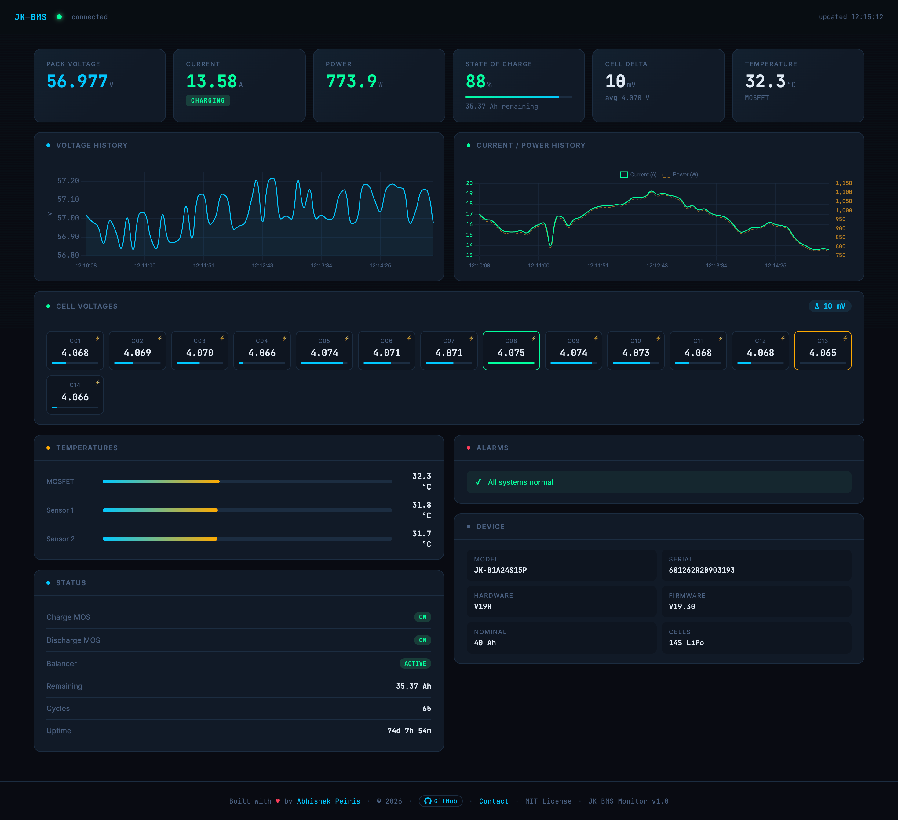

# JK BMS Monitor

A lightweight, self-hosted battery monitoring dashboard for **JK BMS** units, built with **FastAPI**, **MQTT**, and **SQLite**. Runs on any Linux server - including Oracle Cloud Free Tier - and connects to your ESP32 running ESPHome.



**Live data · Cell voltages · Alarms · History · No cloud dependency**

---

## Table of Contents

- [Features](#features)
- [Architecture](#architecture)
- [ESPHome vs Home Assistant](#esphome-vs-home-assistant)
- [Requirements](#requirements)
- [Quick Start (Local)](#quick-start-local)
- [Server Deployment](#server-deployment)
  - [Oracle Cloud Free Tier](#oracle-cloud-free-tier)
  - [Server Setup](#server-setup)
  - [Mosquitto MQTT Broker](#mosquitto-mqtt-broker)
  - [Deploy the App](#deploy-the-app)
  - [Systemd Service](#systemd-service)
  - [Nginx Reverse Proxy](#nginx-reverse-proxy)
  - [Firewall Setup](#firewall-setup)
- [Configuration](#configuration)
- [API Reference](#api-reference)
- [Contributing](#contributing)
- [License](#license)

---

## Features

- Real-time pack voltage, current, power, and State of Charge (SoC)
- Per-cell voltage grid with min/max highlighting and balancer indicator
- Temperature monitoring (MOSFET, Sensor 1, Sensor 2)
- Charge/discharge MOS and balancer status
- Alarm detection (overvoltage, undervoltage, overcurrent, over-temperature)
- Historical charts with configurable time window and interval
- REST API for integration with other tools
- Automatic data cleanup (configurable retention period)
- Zero external dependencies - SQLite, no Redis, no Postgres

---

## Architecture

```
ESP32 (ESPHome)
      │
      │  MQTT publish  (bms/jk/pack  +  bms/jk/cells)
      ▼
Mosquitto Broker  (port 1883)
      │
      │  subscribe
      ▼
FastAPI App  (main.py)
  ├─ MQTT thread  →  SQLite (bms.db)
  └─ HTTP API     →  Dashboard (dashboard.html)
```

The MQTT thread and the FastAPI async loop run concurrently. A background task prunes data older than `KEEP_DAYS` each night at 03:00.

---

## This Project vs Home Assistant

Your ESP32 reads the JK BMS and publishes data over MQTT. You need something on the server side to receive, store, and display that data. The two main options are **this project** or **Home Assistant**.

> **Note:** ESPHome is firmware that runs on the ESP32 itself - it is not part of this project and is separate from Home Assistant too. This project works with any ESP32 firmware that publishes to the correct MQTT topics.

### This Project (FastAPI + MQTT + SQLite)

| Pros                                    | Cons                                                     |
|-----------------------------------------|----------------------------------------------------------|
| Very lightweight - runs on 1 GB RAM     | No push notifications or automations                     |
| Full data ownership, no cloud required  | No native app - install as web app on mobile (see below) |
| Simple to deploy and maintain           | Requires basic Linux/server knowledge                    |
| Single SQLite file - trivial to back up | No integration with other smart home devices             |
| Dedicated BMS UI, fast and focused      | Limited to what this dashboard provides                  |
| Works fully offline, no account needed  | You maintain it yourself                                 |

### Home Assistant

| Pros                                             | Cons                                  |
|--------------------------------------------------|---------------------------------------|
| Rich UI, mobile app, push notifications          | Heavy - needs 2-4 GB RAM minimum      |
| Built-in automations (e.g. alert when SoC < 20%) | Complex to set up and keep updated    |
| Huge ecosystem - integrate anything              | Updates can break configurations      |
| Energy dashboard built-in                        | Overkill if BMS is your only use case |
| Active community and hundreds of add-ons         | Slower data pipeline vs direct MQTT   |

**When to use this project:** you want a lightweight, dedicated BMS monitor and don't need a full smart home platform.

**When to use Home Assistant:** you already run HA, want automations, or want to combine BMS data with other devices in one place.

#### Installing the dashboard on your phone

The dashboard can be installed as a web app on any mobile device - it works like a native app with its own icon and full-screen view.

**Android (Chrome):**
1. Open the dashboard URL in Chrome
2. Tap the three-dot menu → **Add to Home screen**
3. Tap **Add** - an icon appears on your home screen

**iPhone / iPad (Safari):**
1. Open the dashboard URL in Safari
2. Tap the Share button → **Add to Home Screen**
3. Tap **Add** - the dashboard opens full-screen, no browser UI

---

## Requirements

- Python 3.9+
- An MQTT broker (Mosquitto recommended)
- ESP32 publishing JSON to MQTT topics `bms/jk/pack` and `bms/jk/cells`
- A Linux server (local, VPS, or Oracle Cloud Free Tier)

---

## Quick Start (Local)

Clone the repo and run locally in under 5 minutes.

```bash
# 1. Clone
git clone https://github.com/peirisabhi/JK_BMS_FastAPI.git
cd JK_BMS_FastAPI

# 2. Create virtual environment
python3 -m venv venv
source venv/bin/activate

# 3. Install dependencies
pip install -r requirements.txt

# 4. Configure environment
cp .env.example .env
nano .env          # set MQTT_HOST, MQTT_USER, MQTT_PASS

# 5. Run
.venv/bin/uvicorn main:app --host 127.0.0.1 --port 8000 --reload
```

Open `http://localhost:8000` in your browser.

---

## Server Deployment

### Oracle Cloud Free Tier

Oracle Cloud offers a **permanently free** VM that is more than enough to run this project.

**Sign up:** https://cloud.oracle.com/free

**What you get for free (Always Free tier):**
- 2x AMD-based VMs - **1 OCPU, 1 GB RAM each, always free**
- 200 GB block storage
- Outbound data transfer included

**This project runs comfortably on the free AMD instance (1 OCPU / 1 GB RAM).** FastAPI + Mosquitto + SQLite together use well under 200 MB RAM at idle.

**How to create the instance:**

1. Log in to Oracle Cloud Console → Compute → Instances → Create Instance
2. Choose **Ubuntu 22.04** as the OS image
3. Shape: **VM.Standard.E2.1.Micro** (AMD) - 1 OCPU, 1 GB RAM — this is the always-free tier
4. Under Networking, make sure a **public IP** is assigned
5. Upload your SSH public key (or generate one in the wizard)
6. Click Create - it will be ready in about 2 minutes
7. Note your instance's **public IP address**

**Connect via SSH:**
```bash
ssh ubuntu@<YOUR_PUBLIC_IP>
```

---

### Server Setup

Run these commands after SSHing into your server.

```bash
# Update system
sudo apt update && sudo apt upgrade -y

# Install Python 3, pip, venv, git, nginx
sudo apt install -y python3 python3-pip python3-venv git nginx

# Create a directory for the app
mkdir -p /home/ubuntu/bms
cd /home/ubuntu/bms
```

---

### Mosquitto MQTT Broker

```bash
# Install Mosquitto
sudo apt install -y mosquitto mosquitto-clients

# Enable and start
sudo systemctl enable mosquitto
sudo systemctl start mosquitto
```

**Configure authentication (recommended):**

```bash
# Create a password file
sudo mosquitto_passwd -c /etc/mosquitto/passwd esp32

# Create config
sudo nano /etc/mosquitto/conf.d/bms.conf
```

Paste this into the config file:

```
listener 1883
allow_anonymous false
password_file /etc/mosquitto/passwd

# WebSocket listener (required for the browser dashboard)
listener 9001
protocol websockets
allow_anonymous false
password_file /etc/mosquitto/passwd
```

```bash
# Restart Mosquitto
sudo systemctl restart mosquitto

# Test connection
mosquitto_pub -h localhost -p 1883 -u esp32 -P your_password -t test -m hello
```

---

### Deploy the App

```bash
# Clone the repo
cd /home/ubuntu/bms
git clone https://github.com/peirisabhi/JK_BMS_FastAPI.git .

# Create virtual environment
python3 -m venv venv
source venv/bin/activate

# Install dependencies
pip install -r requirements.txt

# Configure environment
cp .env.example .env
nano .env
```

Set these values in `.env`:

```
MQTT_HOST=localhost
MQTT_PORT=1883
MQTT_USER=esp32
MQTT_PASS=your_password_here
DB_PATH=/home/ubuntu/bms/bms.db
KEEP_DAYS=30
```

**Test it runs:**

```bash
venv/bin/uvicorn main:app --host 127.0.0.1 --port 8000
# Press Ctrl+C after confirming it starts
```

---

### Systemd Service

Run the app as a background service that starts on boot.

```bash
# Copy the service file
sudo cp bms.service /etc/systemd/system/bms.service

# Edit paths if needed
sudo nano /etc/systemd/system/bms.service
```

The service file expects the app at `/home/ubuntu/bms` and venv at `/home/ubuntu/bms/venv`. Adjust if your paths differ.

```bash
# Enable and start
sudo systemctl daemon-reload
sudo systemctl enable bms
sudo systemctl start bms

# Check it's running
sudo systemctl status bms

# View live logs
journalctl -u bms -f
```

---

### Nginx Reverse Proxy

Nginx sits in front of uvicorn and handles HTTPS termination.

```bash
sudo nano /etc/nginx/sites-available/bms
```

Paste this (replace `YOUR_DOMAIN_OR_IP`):

```nginx
server {
    listen 80;
    server_name YOUR_DOMAIN_OR_IP;

    location / {
        proxy_pass         http://127.0.0.1:8000;
        proxy_set_header   Host $host;
        proxy_set_header   X-Real-IP $remote_addr;
        proxy_set_header   X-Forwarded-For $proxy_add_x_forwarded_for;
        proxy_http_version 1.1;
        proxy_set_header   Upgrade $http_upgrade;
        proxy_set_header   Connection "upgrade";
    }
}
```

```bash
# Enable the site
sudo ln -s /etc/nginx/sites-available/bms /etc/nginx/sites-enabled/
sudo nginx -t
sudo systemctl reload nginx
```

**Optional — HTTPS with Let's Encrypt (free SSL):**

```bash
sudo apt install -y certbot python3-certbot-nginx
sudo certbot --nginx -d your.domain.com
```

---

### Firewall Setup

#### Linux UFW (on the server)

```bash
# Enable UFW
sudo ufw enable

# Allow SSH (do this FIRST or you will lock yourself out)
sudo ufw allow 22/tcp

# Allow HTTP and HTTPS
sudo ufw allow 80/tcp
sudo ufw allow 443/tcp

# Allow MQTT (only if your ESP32 connects from outside the server)
# Skip this if ESP32 is on the same network as the server
sudo ufw allow 1883/tcp

# Allow MQTT WebSocket (required for the browser dashboard)
sudo ufw allow 9001/tcp

# Check status
sudo ufw status verbose
```

#### Oracle Cloud — Security List Rules

Oracle Cloud has its own firewall (Security Lists) **in addition to** UFW. You must open ports in both places.

1. In Oracle Cloud Console → Networking → Virtual Cloud Networks → your VCN
2. Click **Security Lists** → Default Security List
3. Click **Add Ingress Rules** and add:

| Stateless | Source CIDR | Protocol | Port | Description |
|-----------|-------------|----------|------|-------------|
| No | 0.0.0.0/0 | TCP | 80 | HTTP |
| No | 0.0.0.0/0 | TCP | 443 | HTTPS |
| No | 0.0.0.0/0 | TCP | 1883 | MQTT |
| No | 0.0.0.0/0 | TCP | 9001 | MQTT WebSocket |

> **Security note:** port 1883 (MQTT) should ideally be restricted to your ESP32's IP only, not `0.0.0.0/0`, to prevent unauthorised access.

---

## Configuration

All configuration is via environment variables (`.env` file):

| Variable | Default | Description |
|----------|---------|-------------|
| `MQTT_HOST` | `localhost` | MQTT broker hostname or IP |
| `MQTT_PORT` | `1883` | MQTT broker port |
| `MQTT_USER` | `esp32` | MQTT username |
| `MQTT_PASS` | _(empty)_ | MQTT password |
| `DB_PATH` | `./bms.db` | SQLite database file path |
| `KEEP_DAYS` | `30` | Days of history to retain |

---

## API Reference

All endpoints are `GET`. Base URL: `http://your-server/`

| Endpoint | Parameters | Description |
|----------|-----------|-------------|
| `GET /` | — | Live dashboard (HTML) |
| `GET /api/latest` | — | Most recent BMS snapshot |
| `GET /api/history` | `hours` (1–8760), `interval` (1–60 min) | Downsampled time-series |
| `GET /api/cells/history` | `cell` (1–24), `hours` (1–8760) | Single cell voltage history |
| `GET /api/stats` | `hours` (1–8760) | Min/max/avg aggregates |
| `GET /api/alarms` | `limit` (1–1000) | Readings with active alarms |
| `GET /api/status` | — | MQTT connection health |

Interactive API docs: `http://your-server/docs`

---

## MQTT Payload Format

The ESP32 should publish JSON to these topics:

**`bms/jk/pack`**
```json
{
  "voltage": 52.4,
  "current": 12.3,
  "power": 644.5,
  "soc": 87,
  "remain_ah": 34.8,
  "nominal_ah": 40.0,
  "cycles": 12,
  "temp_mosfet": 32.1,
  "temp1": 28.5,
  "temp2": 27.9,
  "charge_mos": true,
  "disch_mos": true,
  "balancer": false,
  "avg_cell_v": 3.743,
  "min_cell_v": 3.731,
  "max_cell_v": 3.756,
  "delta_mv": 25,
  "alarm_ov": false,
  "alarm_uv": false,
  "alarm_oc": false,
  "alarm_ot": false,
  "uptime_sec": 86400
}
```

**`bms/jk/cells`**
```json
{
  "c01": 3.731, "c02": 3.744, "c03": 3.756,
  "c04": 3.741, "c05": 3.738, "c06": 3.745
}
```

---

## Contributing

Pull requests are welcome. For major changes, please open an issue first to discuss what you'd like to change.

1. Fork the repo
2. Create a feature branch (`git checkout -b feature/your-feature`)
3. Commit your changes (`git commit -m 'Add some feature'`)
4. Push to the branch (`git push origin feature/your-feature`)
5. Open a Pull Request

---

## Author

**Abhishek Peiris**
- GitHub: [@peirisabhi](https://github.com/peirisabhi)

[//]: # (- Email: abhishekpeiris9@gmail.com)

---

## License

This project is licensed under the **MIT License** - see [LICENSE](LICENSE) for details.

[//]: # (---)

[//]: # (*Built with ♥ for the off-grid and DIY battery community.*)
